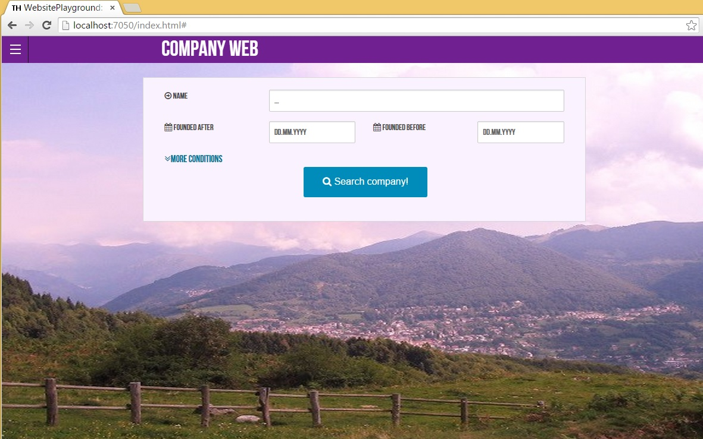

# Website-playground (dotnet-mysql) #

This repository has 4 different git-branches as templates to choose from:

- [Dotnet 8.0 with Microsoft SQL Server + SSDT (dacpac)](https://github.com/Thorium/WebsitePlayground/tree/dotnet-ssdt)
- [.Net Framework 4.8.1 with Microsoft SQL Server + SSDT (dacpac)](https://github.com/Thorium/WebsitePlayground/tree/net48-ssdt)
- [Dotnet 8.0 with MySQL (MariaDB)](https://github.com/Thorium/WebsitePlayground/tree/dotnet-mysql)
- [.Net Framework 4.8.1 with MySQL (MariaDB)](https://github.com/Thorium/WebsitePlayground/tree/net48-mysql)

## Overview ##

This is yet another template for web-sites (a.k.a. playing with some technologies).
What are the key points:

- The same web-server works on Mac / Windows / Ubuntu.
- No O/R-mapping, no n-tiers, no huge amount of manual object-to-object-mapping
- No direct SQL-clauses, no SQL-injection problems.
- No APIs inside one software. Not SOAP nor REST.
- Real-time communication between server and clients.

Technology-stack:

- General: Git, Markdown
- SQL-Server: [SQLProvider](https://github.com/fsprojects/SQLProvider) supports any: MS-SQL/Postgres/Oracle/MySql/MariaDB/SQLite/MS-Access. Instructions for MariaDB are included; MySql should work as well. Also, some for SQLite database and MS-SQL scripts if you want to use those.
- Backend: .NET Core, F# (FSharp), Paket, TypeProviders, Saturn, Giraffe, SignalR (WebSockets/Long-Polling), Logary
- Frontend: Gulp, React.js, Less/Sass, Bootstrap or Foundation.css, FontAwesome, Lodash, jQuery / jQuery-UI, TypeScript / ES6. The demo site is Foundation, but infra supports Bootstrap notation as well.
- Maybe in the future: Crossroads.js, Rx/Rx.Js, FsUnit.xUnit, Canopy 

Documentation:

- [More about the Technology-stack](specifications/Technologies.md)
- [How to install the environment](specifications/Deployment.md)
- [General developer instructions](specifications/Development.md)

There are two screens: 1) You can search for companies. 2) CRUD-operations for companies.

